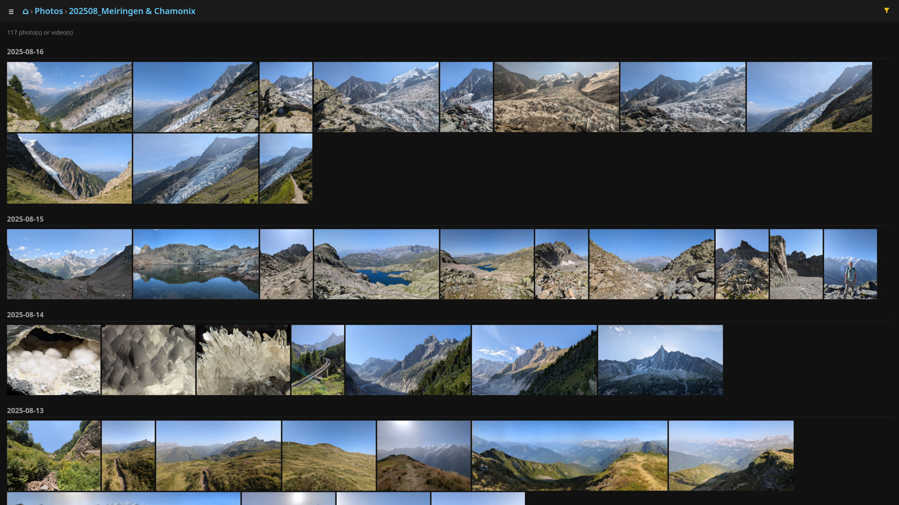

# digikam-web

A vibe-coded web interface to [Digikam](https://www.digikam.org/), allowing remote access to your Digikam photo albums.

 

## Features

* Browse albums and sub-albums, with a day-grouped photo grid
* Filter by tag, rating, media type (photos/videos), aspect ratio, and sub-albums
* Bookmarks (saved album + filter views)
* Full-screen lightbox: zoom/pan, keyboard navigation, video playback, slideshow, reverse-image-search (Yandex), and a metadata/info panel
* `/random` endpoint for screensavers / photo frames
* JSON API
* Installable on Android (and desktop) as a PWA

## Running

You can build and run `digikam-web` using Nix. To serve the Digikam database at its default location (`~/.local/share/digikam/db/digikam4.db`):

```console
nix run github:edolstra/digikam-web
```

For available options, add `--help`:

```console
nix run github:edolstra/digikam-web -- --help
```

### NixOS

The flake exposes a NixOS module as `nixosModules.default`, which defines a systemd service running the backend. Add this flake as an input and import the module:

```nix
{
  inputs.digikam-web.url = "github:edolstra/digikam-web";

  outputs = { nixpkgs, digikam-web, ... }: {
    nixosConfigurations.myhost = nixpkgs.lib.nixosSystem {
      modules = [
        digikam-web.nixosModules.default
        {
          services.digikam-web = {
            enable = true;
            user = "alice";   # whose ~/.local/share/digikam DB is served
            port = 8080;      # optional, defaults to 8080 (bound to 127.0.0.1)
          };
        }
      ];
    };
  };
}
```

For security and performance (HTTP/2), it's best to use reverse proxy like `nginx` in front of `digikam-web`, e.g.

```nix
services.nginx = {
  enable = true;
  recommendedProxySettings = true;
  virtualHosts."photos.example.org" = {
    forceSSL = true;
    useACMEHost = "photos.example.org";
    locations."/".proxyPass = "http://localhost:8080";
  };
};

networking.firewall.allowedTCPPorts = [ 443 ];
```

## Technical notes

* Backend in Rust (axum + rusqlite).
* Frontend is a vanilla-JS single-page app served by the backend.
* Digikam's PGF thumbnails are decoded in the browser via [webpgf](https://github.com/haplo/webpgf) compiled to WebAssembly.

## Missing features

* `digikam-web` currently lacks authentication of any kind.
